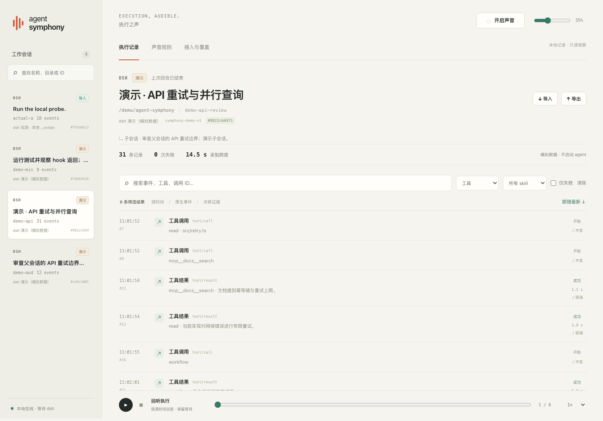
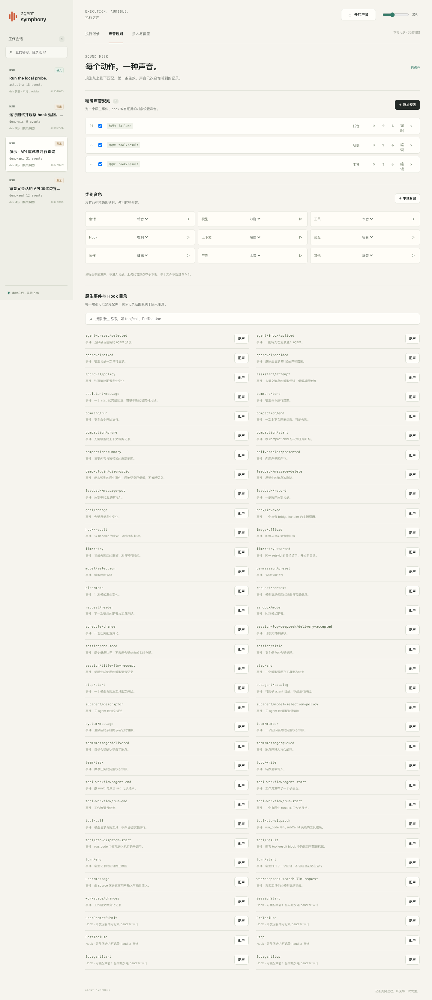
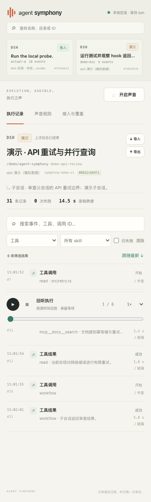

# Agent Symphony

把 dsh 的执行过程记录下来，也让它发出可辨认的声音。

这是一个本地运行的小工具：左侧切换 session，中间查看原生事件，点开事件调查调用、结果、hook 与 skill 证据；同一份记录驱动现场声音和历史回放。当前 **0.1.0 已实现 dsh 接入**，面向 `@deepseek-ai/dsh@0.1.6-alpha.2`。Codex、Claude Code、Pi 暂时只有研究资料，未实现适配。

## 界面预览

桌面时间线：切换 session、筛选执行事件，并查看调用详情与回放位置。截图来自当前可运行版本，包含明确标记的演示 session 与导入的 dsh 联调记录。



<details>
<summary>声音设置：逐事件与 hook 配声</summary>

为原生事件、hook、工具和 skill 设置匹配规则，选择音色、调整音量，也可以上传本地音频并试听。



</details>

<details>
<summary>手机布局：390px 宽度下查看 session 与事件</summary>

窄屏下可以横向浏览 session，继续使用事件筛选、详情和回放。



</details>

## 启动

需要 **Node.js 24+**、pnpm。没有前端构建步骤。

```sh
pnpm install
pnpm start --demo
```

打开 **http://127.0.0.1:4317**。首次点击右上角「开启声音」以允许浏览器发声。三个示例 session 始终标记为「演示」，可以切换、筛选、回放和修改声音。

```sh
pnpm start                          # 空白记录器，不主动添加演示
pnpm start --port 4319              # 自定义端口
pnpm start --data-dir ./.symphony   # 自定义本地记录目录
pnpm start doctor                  # 检查记录器是否运行、dsh 是否近期连接
```

默认记录目录是 `~/.local/share/agent-symphony`。SQLite 保存事件、配置和声音资源索引，音频文件单独保存在该目录；刷新页面或重启服务不会丢掉已保存的数据。服务只监听 loopback。

## 接入真实 dsh

启动 Symphony 后，在「接入与覆盖」页复制已生成的命令。记录器会在自己的数据目录生成 `dsh-observer.generated.patch.yml`，通过官方 `- insert:` 配置把观察插件加到 dsh 根级。

将 `--patch` 加入你正常使用的 dsh 命令，例如：

```sh
dsh --profile headless --patch /absolute/path/dsh-observer.generated.patch.yml '你的任务'
```

如果尚未安装 dsh，可以用已固定版本的 `pnpm dlx @deepseek-ai/dsh@0.1.6-alpha.2` 代替上面的 `dsh`。模型与项目配置仍按 dsh 原来的方式提供。也可生成单独的接入文件：

```sh
pnpm start setup-dsh --out ./symphony.patch.yml
```

`setup-dsh` 与启动时生成的 patch 都不会修改 `~/.dsh` 或已有 profile。改变 Symphony 的端口／数据目录后，应让 dsh 使用新的配置。已经运行但未加载观察插件的进程，需要通过其正常配置加载机制接入；网页不能凭空附着到它。

详细配置、已验证的 profile 参数顺序、完整限制和隔离联调方法见 [dsh 接入指南](docs/dsh-setup.md)。

## 已实现的能力

| 能力 | 实际行为 |
| --- | --- |
| Session 记录与切换 | 使用来源实例 + 原生 session ID 区分会话，展示目录、父 session、采集缺口与最近已观察状态；切换不操作 agent |
| 原生执行时间线 | 覆盖目录中的 58 种持久事件，未知插件事件也保留；支持搜索、类别和失败筛选 |
| 调用调查 | 基于原生 call ID、turn、step、hook invocation 证据关联起止；可查看已保存的原始 JSON、结果、耗时与关联记录 |
| Skill 调查 | 筛选明确 skill 工具请求、结果与显式注入证据；不会把随后全部动作自动归属给 skill |
| 逐事件／hook 配声 | 全目录均可设置；支持工具／skill 名精确或包含匹配、调用关键词，以及 hook point、handler ID、事件或结果的精确匹配 |
| 音频 | 七种内置短音（含不和谐音）和静音、本地音频上传、试听、全局与规则音量；工具返回和失败有可区分的默认音色 |
| 回放 | 播放／暂停／停止、位置选择、0.5–8 倍速；可靠源时间保留原间隔，时间不完整时明确按事件顺序试听 |
| 导入与导出 | Symphony JSON、dsh v3 JSONL、完整 zstd 拼接帧；导入标记为历史，不触发现场声音 |
| 连接与恢复 | SSE 断线重连并静默补采；插件有界队列、批量投递、有限重试、心跳与明确 gap |

声音规则从上到下首次匹配，静音不会再回落到默认音色。规则、音量与自定义音频由本地服务保存；事件详情可以核对当前匹配规则和本页面的播放记录。具体 handler ID 是宿主运行时标识，不保证跨进程对应同一配置脚本。

## 用声音关注某个 Skill 或工具

在「声音规则」中点击「＋ 关键词提示」，会打开预填 `gstack` 和「不和谐音」的规则。可以修改关键词、试听并保存；保存后规则位于列表顶部。开启声音后，当前选中 session 的新调用命中就会发声，历史记录可通过回放检查。

- **精确名称**：在「添加规则」里填写工具名或 Skill 名，例如 `mcp__gstack__browse` 或来源记录的 `review`，选择「精确名称」。区分大小写。
- **名称包含**：将相应名称的匹配方式设为「包含文字」，填写 `gstack`。忽略大小写，按字面匹配，不支持正则。
- **调用关键词**：调用发起时，工具名、具名 Skill 或完整参数任一包含关键词即可命中。例如 `read` 的 `/…/gstack/review/SKILL.md` 路径、`bash` 命令；明确的 Skill 注入也按名称检查。聊天文字、工具返回内容、审批请求不参与这项匹配，返回阶段不会重复触发关键词提示。

填写的不同条件需同时满足；名称与关键词条件也遵守从上到下首次匹配。点开命中事件，可看到匹配字段和包含关键词的片段。读取 Skill 文件只说明发生了相关读取；关键词命中不证明 Skill 已执行，也不自动判断调用是否得到授权。

当前功能覆盖已接入的 **dsh** 事件。未接入的 Codex、Claude Code、Pi，及来源未提供的内部动作仍无法检测；没有命中不能证明没有执行。

## 历史文件

界面「导入」可选择文件，「导出」下载当前 session。也可在命令行操作：

```sh
pnpm start import /path/to/session.v3.jsonl.zstd
pnpm start export SESSION_KEY --out ./recording.symphony.json
```

`SESSION_KEY` 是 Symphony 的内部会话键，可从浏览器 API 的 `/api/sessions` 取得。CLI 导入时若网页已开着，刷新即可看到；网页导入会即时更新。CLI 导出拒绝覆盖现有文件。

物理 dsh 文件使用官方格式目录解码，Zstandard 逐帧验证；不改写、修复或迁移原文件。当前仅接受 v3，损坏／不完整文件直接报错，单次导入及解压上限 32 MB。官方源时间与接收时间分别保存。导入记录独立于实时来源，避免把历史补采冒充当前执行。

## 旁观边界

观察插件只订阅提交后的 `session/event`，同步回调不等待网络。音频在浏览器播放，关闭声音或网页不会影响 agent。插件仍有 CPU／内存开销；队列满、事件过大、重试耗尽、进程退出都可能造成缺口，界面会展示已获知的缺失证据。

dsh 不提供的逐 handler 审计无法凭空补齐：例如 SessionStart 与部分 detached subagent hook；持久事件也不等于实时 token 流。配置声音可以覆盖这些目录项，实际发声需要收到相应证据。

记录器会脱敏常见凭据字段（Authorization、API key、password 等，包括 JSON 工具参数）；自由文本不保证自动清除秘密。记录保存在本机，不自动上传，不主动删除；当前实现保留脱敏后的事件以便调查。请按实际工作内容管理导出文件。

## 验证

```sh
pnpm check             # JS 语法检查
pnpm test              # 领域、存储、HTTP、导入和观察器边界测试
pnpm exec playwright install chromium
pnpm test:browser      # 桌面/390px、筛选、配声、回放、导入、上传和现场模拟
pnpm test:integration  # 需按接入指南准备隔离 dsh runtime
```

真实联调使用已发布的 dsh AgentLoop、工具管线、Codex hook bridge、bash/subprocess 与 Cordis Loader。一个本地 scripted provider 驱动两次模型请求、一次真实工具和一次真实 hook shell，经本项目接收端保存 18 条原生事件。没有外部模型费用，也没有读取用户生产配置。断线重试和卸载另外通过故障测试验证。

联调记录可通过 `SYMPHONY_DSH_EVIDENCE=/path/to/recording.symphony.json pnpm test:integration` 导出。它是本地确定响应驱动的真实 dsh 执行，与 UI 模拟事件区分；不代表已经测试用户自己的生产 profile 或远端模型服务。

测试结果、验证边界和界面截图见 [验证记录](docs/verification.md)。

## 设计与研究

- [四平台比较](docs/research/agent-config-comparison.md)：Codex、dsh、Claude Code、Pi 的原生配置与观测差异。
- [dsh 证据](docs/research/platforms/dsh.md)：固定源码与事件目录。
- [声音与观察设计](docs/designs/observation-and-sound-config.md)：配声、覆盖、身份和被动边界。
- [Session 与 Skill 调查](docs/designs/session-investigation.md)：调查目标与交互原则。
- [直接执行发声](docs/designs/direct-execution-sound.md)、[探索方向](docs/exploration.md)、[事件地图](docs/events.md)：实现前的设计讨论，未实现的跨平台设想仍标为提案。

本版未发布到 npm。第三方代码许可见 [THIRD_PARTY_NOTICES.md](THIRD_PARTY_NOTICES.md)。
